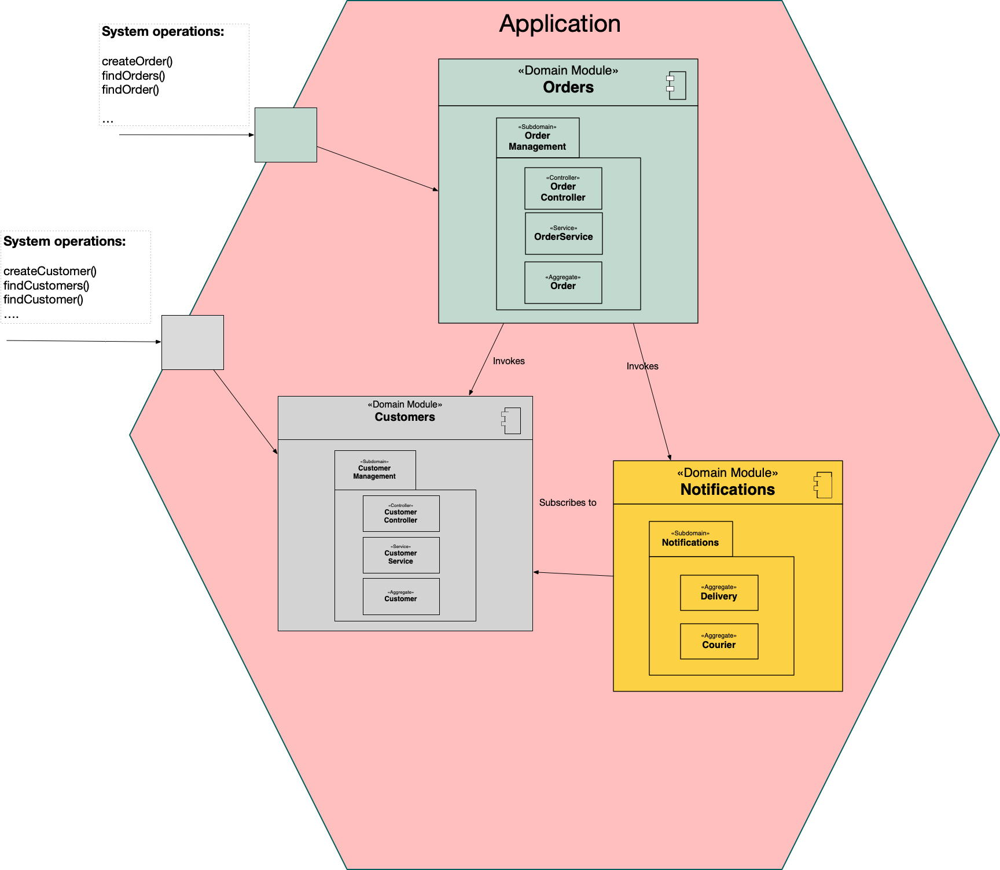

= Modular monolith example: customers and orders

This application is an example of a https://microservices.io/post/architecture/2023/07/31/how-modular-can-your-monolith-go-part-1.html[modular monolith architectural style].

## The application consists of three domain modules

It consists of three domain modules:

* `customers` - manages customers
* `orders` - manages orders
* `notifications` - sends notifications

## A domain module has a hexagonal architecture

A domain module has a hexagonal architecture:

* `domain` - the business logic
* `web` - a inbound adapter that implements a REST API
* `persistence` - an outbound adapter that implements database access

## Domain module collaboration mechanisms

Domains collaborate in two different ways.
The first is by one domain invoking another.
For example:

[java]
----
  @Transactional
  public Order createOrder(long customerId, Money orderTotal) {
      ...
      creditManagement.reserveCredit(customerId, order.getId(), orderTotal);
----

The second collaboration mechanism is the https://microservices.io/post/architecture/2023/10/30/how-modular-can-your-monolith-go-part-5-domain-observers.html[Observer pattern] - one domain subscribes to events emitted by another domain.
For example:

[java]
----
@Service
public class NotificationServiceImpl implements CustomerDomainObserver {

  @PostConstruct
  public void registerCustomerDomainObserver() {
    customerDomainObservers.registerObserver(this);
  }

  @Override
  public void noteCustomerCreated(CustomerInfo customerInfo) {...}
----      

Note: For simplicity, https://microservices.io/post/architecture/2023/11/13/how-modular-can-your-monolith-go-part-6-transactional-commands.html[the observers are executed in the publisher's transaction].

## Minimizing build-time coupling is a key design goal

X is https://microservices.io/post/architecture/2023/09/12/how-modular-can-your-monolith-go-part-4-physical-design.html#apply-physical-design-principles-to-reduce-build-time-coupling[build-time coupled] to Y if a change to Y requires X to be recompiled and, more importantly, retested.
Since fast builds are essential, it's important to minimize build-time coupling.

This example minimizes build-time coupling in a few different ways:

* Domain module = multiple Gradle projects
* Domain modules have a Domain API Gradle sub-project
* Uses the Interface Segregation Principle (ISP) to define narrower APIs.

### Domain module = multiple Gradle projects

To reduce build-time coupling within a domain module, each domain module consists of multiple Gradle sub-projects.
Typically, the sub-projects correspond the elements of the hexagonal architecture - domain or adapter.
As a result, a change to the `web` adapter doesn't require the `domain` or `persistence` adapter to be recompiled/retested.

### Domain modules have a Domain API Gradle sub-project

The `Customers` and `Notifications` domain modules - specifically their domain logic - are used by the `Orders` domain module.
In order to minimize build-time coupling, each of those domain modules has a https://microservices.io/post/architecture/2023/09/12/how-modular-can-your-monolith-go-part-4-physical-design.html#using-domain-api-modules-to-reduce-build-time-coupling[Domain API Gradle sub-project], which defines that module's API.
For example, the `Customers` domain has a `customers-api` Gradle sub-project, which contains its API classes.

A domain module's clients only depend on its Domain API Gradle sub-project.
Moreover, its clients are tested using mocks of the API.
For example, the `Orders` domain is tested using a mock of the `Customers` domain's API.
As a result, a domain module's implementation can be changed without having to recompile/retest its clients.

### Uses the Interface Segregation Principle (ISP) to define narrower APIs.

To further reduce build-time coupling, the `Customers` domain module uses the https://microservices.io/post/architecture/2023/09/12/how-modular-can-your-monolith-go-part-4-physical-design.html#applying-the-interface-segregation-principle-isp[Interface Segregation Principle (ISP)] to define narrower APIs.
It has three Domain Modules API Gradle sub-projects:

* `customers-api` - defines CRUD operations
* `customers-api-credit-management` - defines operations for managing credit
* `customers-api-observer` - for registering observers of the `Customers` domain

As a result, each client only build-time coupled to those APIs that it's actually using.
